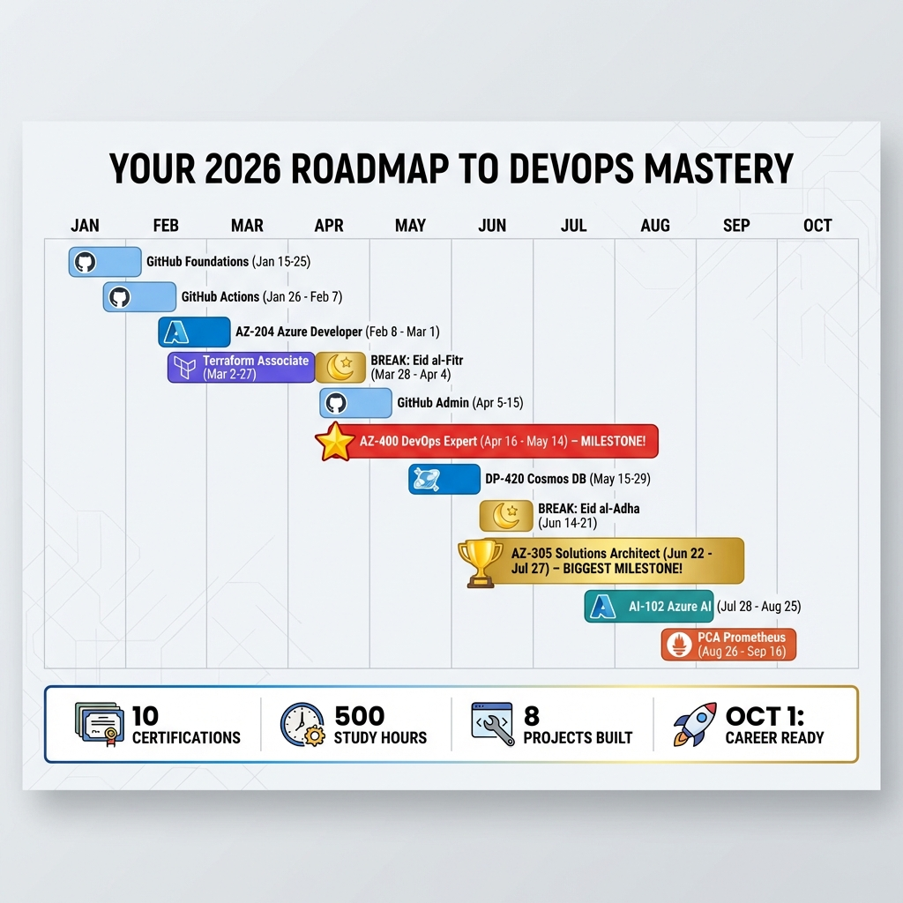

# 🎨 OpsVerse 2026 Certification Journey - Motivational Posters

**Purpose**: Visual motivation and progress tracking for your 8.5-month certification journey

---

## 📥 Available Posters

### **Poster 1: Certification Journey Overview**


**Features:**

- 🚀 Upward progression path through 4 phases
- ⭐ Highlighted major milestones (AZ-400, AZ-305)
- 🏗️ All 8 OpsVerse production projects listed
- 💡 Motivational quote: *"The journey of 1000 commits begins with a single push"*
- 📊 Key stats: 500 Study Hours | 8.5 Months | Career Transformation

**Best For:**

- Desktop wallpaper
- Office wall poster
- LinkedIn announcement image

---

### **Poster 2: Gantt Timeline**



**Features:**

- 📅 Horizontal timeline (January → October 2026)
- 🎨 Color-coded certification bars
- 🌙 Egyptian holidays marked (Eid al-Fitr, Eid al-Adha)
- 🏆 Major milestones highlighted (AZ-400 ⭐, AZ-305 🏆)
- 📈 Bottom stats panel: 10 Certifications | 500 Study Hours | 8 Projects Built | Oct 1: Career Ready

**Best For:**

- Printed planning poster (A3/A4)
- Progress tracking on wall
- Study group presentations

---

## 🖨️ How to Use

### **Print for Your Wall**

```
Recommended: A3 size (11.7" x 16.5")
Alternative: A4 size (8.3" x 11.7")
Paper: Glossy or matte photo paper
Quality: High resolution (300 DPI)
```

**Where to print:**

- Local print shop
- Office printer (color laser recommended)
- Online services (Vistaprint, FedEx Office)

### **Desktop Wallpaper**

1. Right-click poster image
2. "Set as Desktop Background"
3. Choose "Fit" or "Fill" in display settings
4. See it every day for motivation!

### **Share on LinkedIn**

**Sample Post:**

```
🚀 Starting my 2026 DevOps Certification Journey!

📅 Timeline: Jan 15 - Oct 1, 2026
🎓 10 Certifications:
   • GitHub (Foundations, Actions, Admin)
   • Azure (AZ-204, AZ-400, AZ-305, DP-420, AI-102)
   • Terraform Associate
   • Prometheus Certified Associate

🏗️ + Building 8 production projects along the way!

Follow my progress: https://github.com/AhmedAzzu25/OpsVerseStudyGroup

#DevOps #AzureCertification #CloudComputing #CareerDevelopment #2026Goals
```

Attach Poster 1 or Poster 2 to the post.

### **Add to GitHub README**

Already included! See the main README.md for embedded posters.

---

## 📐 Technical Specifications

### Poster 1 (Journey Overview)

- **File**: `certification_journey_poster_1767974670996.png`
- **Dimensions**: 1024x1024 pixels
- **Format**: PNG
- **Colors**: Professional blue gradient, white/gold text
- **Icons**: Tech-themed (database, code, trophy, rocket)

### Poster 2 (Gantt Timeline)

- **File**: `timeline_gantt_poster_1767974698536.png`
- **Dimensions**: 1024x1024 pixels
- **Format**: PNG
- **Colors**: Multi-color (blue, purple, gold, teal, orange)
- **Layout**: Horizontal bars with month markers

---

## 🎯 Usage Ideas

### **Daily Motivation**

- [ ] Set Poster 1 as desktop wallpaper
- [ ] Print Poster 2 and hang above desk
- [ ] Take photo with poster on Day 1 and Day 260

### **Progress Tracking**

- [ ] Mark off certifications on physical Poster 2 as completed
- [ ] Post milestone updates with poster background
- [ ] Use as backdrop for study session videos

### **Accountability**

- [ ] Share with study group
- [ ] Post initial commitment on LinkedIn
- [ ] Tag mentors/colleagues for accountability

### **Celebration**

- [ ] Frame posters after completing all 10 certifications
- [ ] Create "Before & After" comparison
- [ ] Share final victory post with poster

---

## 🎨 Customization Options

Want to personalize your posters? Modify these elements:

**Text Overlay Ideas:**

- Add your name
- Include your target job title
- Add company/organization logo
- Include specific exam dates

**Progress Tracking:**

- Color-code completed vs pending certs
- Add checkmarks as you progress
- Update stats monthly

---

## 📱 Mobile Versions

These posters also work great as:

- **Phone lock screen** - Daily reminder
- **Phone wallpaper** - Constant motivation
- **Social media story** - Progress updates

---

## ✅ Checklist

- [ ] Downloaded both posters
- [ ] Printed Poster 2 for wall
- [ ] Set Poster 1 as desktop wallpaper
- [ ] Shared on LinkedIn (optional)
- [ ] Took "Day 1" photo with poster
- [ ] Set reminder to update progress monthly

---

## 💡 Pro Tip

**Create a "Journey Journal":**

1. Print Poster 2 monthly
2. Mark completed certifications
3. Add notes on what you learned
4. Compare monthly prints to see progress
5. Frame the final one when complete!

---

**Files Ready to Use**: ✅  
**Location**: `docs/certifications/posters/`  
**Status**: Production-ready, print-quality

**Let these posters remind you daily: Your DevOps transformation is happening! 💪🚀**
