# 🚀 MonoPod - All-in-One AI Business Platform

**An enterprise-grade, AI-augmented business operations platform** unifying booking, e-commerce, inventory, CRM, billing, healthcare, banking, analytics, and automation in a single monorepo.

## 🎯 What is MonoPod?

MonoPod is a production-ready, multi-tenant SaaS platform designed for modern businesses. It provides:

- **Domain Modules**: Booking, Commerce, IMS, CRM, Billing, Reports, Analytics, Healthcare, Banking
- **Platform Services**: Identity, Notifications, Files, Audit, Feature Flags, Background Jobs
- **AI & Automation**: Intelligent agents + n8n workflow orchestration
- **Regional Compliance**: GDPR (EU), SOC2 (USA), VAT (Gulf), Offline-first (Africa)
- **DevOps-First**: Full observability, IaC, CI/CD pipelines

## 🏗️ Architecture

```mermaid
graph TB
    subgraph "Channels"
        Web[Web App]
        Mobile[Mobile App]
        API[Public API]
        Admin[Admin Console]
    end
    
    subgraph "Edge Layer"
        Gateway[API Gateway<br/>Auth • Rate Limit • WAF]
    end
    
    subgraph "Domain Modules"
        Booking[📅 Booking]
        Commerce[🛒 Commerce]
        IMS[📦 IMS]
        CRM[🤝 CRM]
        Billing[💳 Billing]
        Reports[📊 Reports]
        Analytics[📈 Analytics]
        Healthcare[🏥 Healthcare]
    end
    
    subgraph "Platform Services"
        Identity[🔐 Identity]
        Notifications[📧 Notifications]
        Files[📁 Files]
        Audit[📝 Audit]
        FeatureFlags[🎚️ Feature Flags]
        Jobs[⚙️ Background Jobs]
    end
    
    subgraph "AI & Automation"
        AIAgents[🤖 AI Agents]
        Automation[🔄 n8n Workflows]
    end
    
    subgraph "Data Layer"
        DB[(Databases)]
        Queue[Message Queue]
        Cache[Cache]
    end
    
    Web --> Gateway
    Mobile --> Gateway
    API --> Gateway
    Admin --> Gateway
    
    Gateway --> Booking
    Gateway --> Commerce
    Gateway --> IMS
    Gateway --> CRM
    Gateway --> Billing
    Gateway --> Reports
    Gateway --> Analytics
    Gateway --> Healthcare
    
    Booking --> Identity
    Commerce --> Identity
    IMS --> Identity
    
    IMS --> Notifications
    Billing --> Notifications
    
    IMS --> AIAgents
    AIAgents --> Automation
    Automation --> IMS
    
    IMS --> DB
    IMS --> Queue
    IMS --> Cache
```



## 🚀 Quick Start

### Prerequisites

- Docker & Docker Compose
- .NET 8 SDK (for IMS module)
- Node.js 20+ (for admin console)
- Git

### One-Command Setup

```bash
# Clone the repository
git clone https://github.com/AhmedAzzu25/OpsVerseStudyGroup.git
cd OpsVerseStudyGroup/monopod

# Start the entire platform
docker-compose up -d

# Check health
docker-compose ps
```

### Access Points

| Service | URL | Credentials |
|---------|-----|-------------|
| API Gateway | <http://localhost:5000> | - |
| Admin Console | <http://localhost:3000> | <admin@monopod.io> / Admin@123 |
| IMS API | <http://localhost:5001> | See Identity service |
| n8n Automation | <http://localhost:5678> | - |
| Grafana | <http://localhost:3001> | admin / admin |
| RabbitMQ | <http://localhost:15672> | guest / guest |

## 📁 Repository Structure

```
/monopod
  /apps                          # Channel applications
    /gateway                     # API Gateway (YARP)
    /admin-console              # React admin UI
  /modules                       # Domain modules
    /booking                    # Appointment scheduling
    /commerce                   # E-commerce
    /ims                        # ✅ Inventory Management (Reference)
    /crm                        # B2B CRM
    /billing                    # Subscriptions & invoicing
    /reports                    # Report generation
    /analytics                  # Dashboards & KPIs
    /healthcare-pack            # Healthcare IT
    /banking-pack              # Compliance & risk
    /ai-agents                 # AI assistants
    /automation                # n8n workflows
  /platform                      # Shared services
    /identity                   # Multi-tenant auth
    /notifications             # Email/SMS/WhatsApp
    /files                     # Storage management
    /audit                     # Compliance logs
    /feature-flags             # Regional toggles
    /jobs                      # Background tasks
  /infra                        # Infrastructure as Code
    /terraform                 # Cloud deployment
    /k8s                       # Kubernetes manifests
    /bicep                     # Azure-specific
  /pipelines                    # CI/CD
    /github-actions            # Workflows
  /observability               # Monitoring
    /logging                  # Loki/ELK
    /metrics                  # Prometheus
    /tracing                  # Jaeger
    /alerting                 # Alertmanager
    /runbooks                 # Operations guides
  /docs                         # Documentation
    /architecture             # System design
    /adr                      # Decision records
    /api                      # OpenAPI specs
    /security                 # Security docs
    /compliance              # Regional compliance
    /product                 # Business docs
    /career                  # Career materials
  /config                       # Configuration
    /regions                   # Regional settings
  /scripts                      # Utility scripts
  docker-compose.yml           # Local orchestration
  README.md                    # This file
  CONTRIBUTING.md             # Development guide
  SECURITY.md                 # Security policy
```

## 🧩 Domain Modules

### ✅ IMS (Inventory Management) - **Reference Implementation**

**Status**: Fully implemented with AI features

**Features**:

- Product catalog management
- Multi-warehouse stock tracking
- Sales order processing
- AI-powered demand forecasting
- Auto-reorder workflows

**Tech Stack**: .NET 8, PostgreSQL, RabbitMQ, Redis, Azure OpenAI

**Documentation**: [modules/ims/README.md](modules/ims/README.md)

### 📅 Booking

**Status**: Scaffold ready

**Features**: Appointment scheduling, provider management, calendar sync, AI scheduling assistant

### 🛒 Commerce

**Status**: Scaffold ready

**Features**: Product catalog, cart, checkout, orders, AI recommendations

### 🤝 CRM (B2B)

**Status**: Scaffold ready

**Features**: Accounts, contacts, deals pipeline, AI lead scoring

### 💳 Billing & Subscriptions

**Status**: Scaffold ready

**Features**: Invoices, payments, subscription plans, regional tax/VAT

### 📊 Reports

**Status**: Scaffold ready

**Features**: Scheduled reports, PDF/CSV export, customizable templates

### 📈 Analytics

**Status**: Scaffold ready

**Features**: Dashboards, KPI tracking, anomaly detection

### 🏥 Healthcare Pack

**Status**: Scaffold ready

**Features**: Clinic profiles, patient records, medication inventory integration

### 🏦 Banking Pack

**Status**: Scaffold ready

**Features**: Audit trails, risk rules, compliance templates

## 🤖 AI & Automation

### AI Agents

- **Ops Agent**: Log monitoring → auto-remediation
- **Business Agent**: Demand analysis → reorder suggestions
- **Dev Agent**: PR review → documentation generation

### n8n Workflows

- **Low Stock Reorder**: IMS event → create PO → notify → ticket
- **Failed Payment Retry**: Billing event → retry → notify → CRM follow-up
- **No-Show Reschedule**: Booking event → SMS → reschedule offer

## 🌍 Regional Support

MonoPod supports region-specific configurations:

| Region | Features |
|--------|----------|
| **Europe** (EU) | GDPR compliance, consent management, data retention, audit exports |
| **Gulf/Middle East** | VAT calculations, Arabic UI (RTL), Entra ID integration, Islamic calendar |
| **Africa/Egypt** | Offline-first mode, low-bandwidth optimization, SMS/WhatsApp priority |
| **USA** | SOC2 readiness, enhanced RBAC, audit evidence export |
| **Global** | Default configuration |

Switch regions via environment variable:

```bash
REGION=eu docker-compose up
```

## 🔐 Security

- **Authentication**: OAuth2/OIDC via Identity service
- **Authorization**: Role-based access control (RBAC)
- **Secrets**: Externalized via environment variables / Key Vault
- **Scanning**: SAST (Semgrep), dependency scanning (Trivy), container scanning
- **Compliance**: GDPR, SOC2 ready, audit logging

See [SECURITY.md](SECURITY.md) for vulnerability reporting.

## 📊 Observability

**Logs**: Structured JSON logs → Loki/ELK  
**Metrics**: Prometheus exporters → Grafana dashboards  
**Traces**: OpenTelemetry → Jaeger  
**Alerts**: Alertmanager → Slack/PagerDuty  
**Runbooks**: [observability/runbooks/](observability/runbooks/)

## 🧪 Testing

Each module follows the testing pyramid:

- **Unit Tests**: Domain logic (>80% coverage)
- **Integration Tests**: Database, messaging, cache
- **E2E Tests**: API contract tests with OpenAPI validation
- **Performance Tests**: Load testing with k6

Run all tests:

```bash
./scripts/run-tests.sh
```

## 🚢 Deployment

### Local Development

```bash
docker-compose up -d
```

### Kubernetes

```bash
kubectl apply -f infra/k8s/
```

### Azure (via Terraform)

```bash
cd infra/terraform/azure
terraform init
terraform plan
terraform apply
```

## 📋 Minimum Compatibility Contract (MCC)

All modules MUST comply with:

✅ **API Contract**: OpenAPI v3 spec, versioning (v1, v2...), standard error model  
✅ **Event Contract**: Event naming (`module.entity.action`), JSON schemas  
✅ **Observability**: Structured logs, metrics endpoint, correlation IDs  
✅ **Security**: OIDC auth, RBAC roles, secrets externalized, SAST passing  
✅ **Testing**: Unit + Integration tests  
✅ **Delivery**: Dockerfile, health checks, one-command run  
✅ **Docs**: README, ADRs, runbook  

See [docs/architecture/mcc-specification.md](docs/architecture/mcc-specification.md)

## 🛠️ Development

### Adding a New Module

1. Copy a scaffold from `modules/` (recommend using `ims` as template)
2. Implement MCC requirements
3. Add module to `docker-compose.yml`
4. Register endpoints in `apps/gateway/`
5. Add CI/CD workflow in `pipelines/github-actions/`
6. Document in module README

See [CONTRIBUTING.md](CONTRIBUTING.md) for detailed guidelines.

### Technology Profiles

Choose your stack per module:

- **Profile A (.NET)**: ASP.NET Core, EF Core, xUnit
- **Profile B (Node)**: NestJS/Express, Prisma, Jest
- **Profile C (Python)**: FastAPI, SQLAlchemy, PyTest
- **Profile D (Go)**: Gin/Fiber, Go test

## 📖 Documentation

- **Architecture**: [docs/architecture/](docs/architecture/)
- **ADRs**: [docs/adr/](docs/adr/)
- **API Specs**: [docs/api/](docs/api/)
- **Security**: [docs/security/](docs/security/)
- **Product**: [docs/product/](docs/product/)

## 💼 Productization

Business materials included:

- **MVP Definition**: [docs/product/mvp-definition.md](docs/product/mvp-definition.md)
- **Pricing Model**: [docs/product/pricing-packaging.md](docs/product/pricing-packaging.md)
- **Demo Script**: [docs/product/demo-script.md](docs/product/demo-script.md)
- **Pitch Deck**: [docs/product/pitch-deck-outline.md](docs/product/pitch-deck-outline.md)

## 🎓 Career Resources

- **CV Templates**: [docs/career/cv-update-template.md](docs/career/cv-update-template.md)
- **Interview Prep**: [docs/career/interview-prep-checklist.md](docs/career/interview-prep-checklist.md)
- **Freelance Services**: [docs/career/freelance-service-templates.md](docs/career/freelance-service-templates.md)

## 🤝 Contributing

We welcome contributions! Please see [CONTRIBUTING.md](CONTRIBUTING.md) for:

- Development workflow
- Code standards
- PR process
- Testing requirements

## 📜 License

This project is licensed under the MIT License - see [LICENSE](LICENSE) file for details.

## 🙏 Acknowledgments

Built as part of the **OpsVerse Study Group** initiative for cloud-native learning.

## 📞 Support

- **Documentation**: [docs/](docs/)
- **Issues**: [GitHub Issues](https://github.com/AhmedAzzu25/OpsVerseStudyGroup/issues)
- **Discussions**: [GitHub Discussions](https://github.com/AhmedAzzu25/OpsVerseStudyGroup/discussions)

---

**MonoPod** - *One Platform, Infinite Possibilities* 🚀
