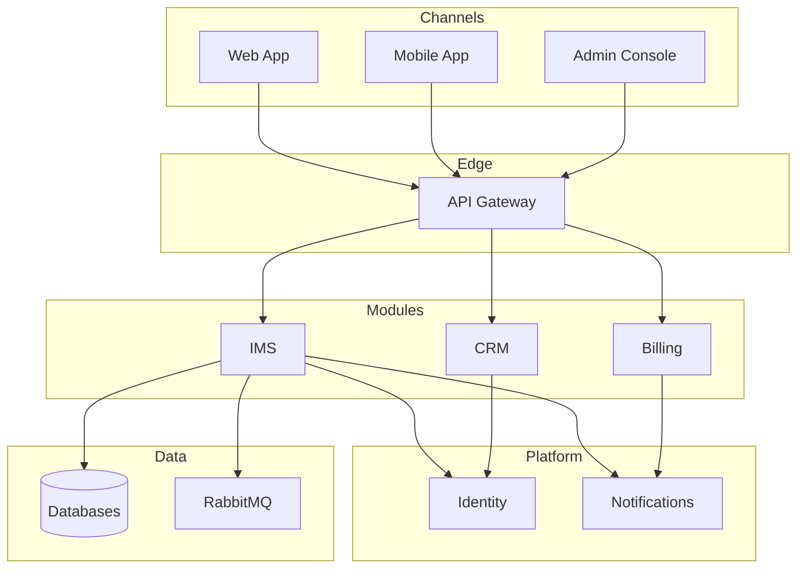
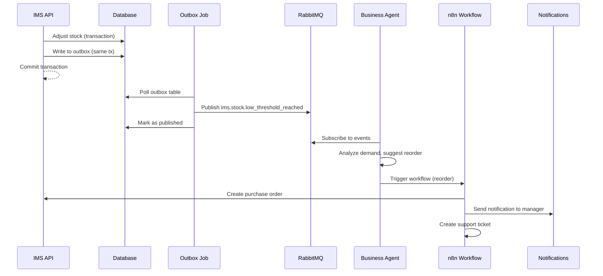

# MonoPod System Architecture

## Overview

MonoPod is an enterprise-grade, multi-tenant AI-driven business operations platform built as a monorepo. It unifies multiple business domains (booking, e-commerce, inventory, CRM, billing, etc.) with shared platform services and AI/automation capabilities.

## Architecture Layers

### 1. Channels Layer

User-facing applications and API clients.

**Components**:

- **Web Application**: React/Next.js SPA
- **Mobile Application**: React Native (iOS/Android)
- **Admin Console**: React admin dashboard (`apps/admin-console/`)
- **Public API**: REST/GraphQL endpoints

**Responsibilities**:

- User authentication
- UI/UX presentation
- Client-side validation
- Offline capabilities (PWA)

---

### 2. Edge Layer

Gateway and security enforcement.

**Components**:

- **API Gateway** (`apps/gateway/`): YARP-based reverse proxy
  - Route aggregation
  - Authentication (OIDC/OAuth2)
  - Rate limiting
  - WAF integration
  - Request/response transformation
  - Correlation ID generation

**Pattern**:

```
Client → API Gateway → Module APIs
         ↓
    [Auth Check]
    [Rate Limit]
    [Logging]
```

---

### 3. Domain Modules Layer

Business capabilities implemented as independently deployable modules.

#### Core Modules

| Module | Purpose | Tech Stack | Status |
|--------|---------|------------|--------|
| **booking** | Appointment scheduling | TBD | Scaffold |
| **commerce** | E-commerce | TBD | Scaffold |
| **ims** | Inventory Management | .NET 8 | ✅ Reference |
| **crm** | B2B CRM | TBD | Scaffold |
| **billing** | Subscriptions & invoicing | TBD | Scaffold |
| **reports** | Report generation | TBD | Scaffold |
| **analytics** | Dashboards & KPIs | TBD | Scaffold |

#### Optional Packs

| Pack | Purpose | Tech Stack | Status |
|------|---------|------------|--------|
| **healthcare-pack** | Clinic/patient management | TBD | Scaffold |
| **banking-pack** | Compliance & risk | TBD | Scaffold |

#### Special Modules

| Module | Purpose | Tech Stack | Status |
|--------|---------|------------|--------|
| **ai-agents** | AI assistants | Python + Azure OpenAI | Scaffold |
| **automation** | n8n workflows | Node.js + n8n | Scaffold |

**Module Characteristics**:

- Independent deployment
- Owns its data store
- Publishes domain events
- Consumes platform services
- MCC compliant (see [MCC Specification](mcc-specification.md))

---

### 4. Platform Services Layer

Shared cross-cutting concerns.

| Service | Purpose | API Endpoint | Tech |
|---------|---------|--------------|------|
| **identity** | Multi-tenant auth | `/api/identity/v1/` | .NET 8 + Duende |
| **notifications** | Email/SMS/WhatsApp | `/api/notifications/v1/` | .NET 8 + Twilio |
| **files** | Storage management | `/api/files/v1/` | .NET 8 + MinIO/Blob |
| **audit** | Compliance logs | `/api/audit/v1/` | .NET 8 + PostgreSQL |
| **feature-flags** | Regional toggles | `/api/features/v1/` | .NET 8 + Redis |
| **jobs** | Background tasks | `/api/jobs/v1/` | .NET 8 + Hangfire |

**Characteristics**:

- Stateless (except audit)
- Horizontally scalable
- Versioned APIs
- Health checks exposed

---

### 5. Data Layer

Persistent storage and messaging.

**Databases**:

- **Module-owned**: Each module has its own database (PostgreSQL)
- **Shared**: Platform services may share a database (platform-db)
- **Pattern**: Database-per-service (preferred) or Shared database (pragmatic)

**Messaging**:

- **Event Bus**: RabbitMQ for asynchronous events
- **Naming**: `{module}.{entity}.{action}` (e.g., `ims.product.created`)
- **Pattern**: Outbox pattern for reliable publishing

**Caching**:

- **Redis**: Distributed cache for sessions, feature flags, API responses

---

### 6. AI & Automation Plane

Intelligent automation and workflow orchestration.

**AI Agents**:

- **Ops Agent**: Monitors logs → auto-remediation
- **Business Agent**: Analyzes data → suggests actions (reorder, churn prevention)
- **Dev Agent**: Reviews PRs → generates docs

**Technology**: Python + LangChain + Azure OpenAI

**Automation**:

- **n8n**: Visual workflow builder
- **Workflows**:
  - Low stock → create PO → notify → ticket
  - Failed payment → retry → notify → CRM
  - No-show → SMS → reschedule

**Integration**: AI agents output decisions → automation executes actions

---

### 7. Observability Layer

Monitoring, logging, tracing, alerting.

**Logging**:

- **Stack**: Loki + Promtail (or ELK)
- **Format**: Structured JSON
- **Fields**: `timestamp`, `level`, `message`, `traceId`, `tenantId`, `userId`

**Metrics**:

- **Collection**: Prometheus
- **Dashboards**: Grafana
- **Metrics**:
  - Request rate, error rate, duration (RED method)
  - CPU, memory, disk (USE method)
  - Business metrics (orders/min, stock levels)

**Tracing**:

- **Stack**: Jaeger or Tempo
- **Standard**: OpenTelemetry
- **Correlation**: `TraceId` propagated across services

**Alerting**:

- **Stack**: Alertmanager → Slack/PagerDuty
- **Runbooks**: `observability/runbooks/`

---

## Architecture Patterns

### Event-Driven Architecture

**Outbox Pattern** (reliable event publishing):

```
Transaction:
  1. Write to business table (e.g., products)
  2. Write to outbox table (same transaction)
  
Background Job:
  3. Read from outbox
  4. Publish to message bus
  5. Mark as published
```

**Event Naming Convention**:

```
{module}.{entity}.{action}
Examples:
  ims.product.created
  ims.stock.low_threshold_reached
  billing.invoice.paid
  booking.appointment.cancelled
```

**Event Schema** (JSON):

```json
{
  "eventId": "uuid",
  "eventType": "ims.product.created",
  "timestamp": "2026-01-10T03:00:00Z",
  "tenantId": "tenant-123",
  "userId": "user-456",
  "data": {
    "productId": "prod-789",
    "name": "Laptop",
    "price": 999.00
  },
  "metadata": {
    "traceId": "00-abc...",
    "source": "ims-api-v1"
  }
}
```

---

### CQRS (Command Query Responsibility Segregation)

**Commands** (write): Change state

```csharp
public record CreateProductCommand(string Name, decimal Price);
```

**Queries** (read): Read state

```csharp
public record GetProductQuery(Guid ProductId);
```

**Benefits**:

- Separate read/write models
- Optimized queries (read replicas, caching)
- Event sourcing compatibility

---

### Multi-Tenancy

**Tenant Isolation**:

- **Data**: Tenant ID in every table (row-level security)
- **API**: Tenant extracted from JWT claims
- **Enforcement**: Middleware validates tenant access

**Tenant Resolution**:

```
Request → JWT → Claims["TenantId"] → DbContext Filter
```

**Database Strategies**:

- **Shared Database, Shared Schema**: Filter by TenantId (current approach)
- **Shared Database, Separate Schema**: Schema per tenant (future)
- **Database per Tenant**: Separate DB per tenant (enterprise)

---

### Regional Configuration

**Feature Flags by Region**:

```csharp
if (regionConfig.Features.Contains("gdpr-consent"))
{
    // Show consent banner
}
```

**Configuration Loading**:

```
Environment Variable REGION=eu
  → Load config/regions/eu.json
  → Apply GDPR, VAT, audit settings
```

**Regions**:

- `global`: Default, minimal compliance
- `eu`: GDPR, VAT, data residency
- `gulf`: Arabic UI, RTL, VAT, Entra ID
- `africa`: Offline-first, low-bandwidth, WhatsApp
- `usa`: SOC2, enhanced RBAC, audit evidence

---

## Technology Stack Profiles

Modules can choose one of four tech stack profiles:

### Profile A (.NET)

- **Framework**: ASP.NET Core 8
- **ORM**: Entity Framework Core
- **Testing**: xUnit, FluentAssertions
- **Frontend**: Angular/React

### Profile B (Node.js)

- **Framework**: NestJS/Express
- **ORM**: Prisma/TypeORM
- **Testing**: Jest
- **Frontend**: Next.js/Vite

### Profile C (Python)

- **Framework**: FastAPI
- **ORM**: SQLAlchemy
- **Testing**: PyTest
- **Frontend**: N/A (API only)

### Profile D (Go)

- **Framework**: Gin/Fiber
- **Testing**: Go test
- **Frontend**: N/A (API only)

---

## Deployment Architecture

### Local Development

```
docker-compose.yml
  ├── gateway (YARP)
  ├── admin-console (React)
  ├── identity (Duende IdentityServer)
  ├── ims (Reference module)
  ├── postgres (shared)
  ├── rabbitmq
  ├── redis
  ├── n8n
  ├── grafana
  ├── prometheus
  └── loki
```

**Command**: `docker-compose up -d`

---

### Production (Kubernetes)

```
Namespace: monopod
  ├── Deployment: gateway (replicas: 3)
  ├── Deployment: ims (replicas: 2)
  ├── Deployment: identity (replicas: 2)
  ├── StatefulSet: postgres
  ├── StatefulSet: rabbitmq
  ├── Deployment: redis
  ├── Ingress: *.monopod.io
  └── HPA: Auto-scaling (CPU/Memory)
```

**Infrastructure**: `infra/k8s/` or `infra/terraform/`

---

## Security Architecture

### Authentication Flow

```
1. User → Login → Identity Service
2. Identity → Validate credentials → Issue JWT
3. User → API request + JWT → Gateway
4. Gateway → Validate JWT → Forward to module
5. Module → Extract TenantId/UserId from JWT → Process
```

**JWT Claims**:

```json
{
  "sub": "user-123",
  "tenant_id": "tenant-456",
  "roles": ["Admin", "InventoryManager"],
  "exp": 1704902400
}
```

### Authorization (RBAC)

**Roles**:

- `Admin`: Full access
- `Manager`: Read/write within tenant
- `Viewer`: Read-only

**Policies** (.NET example):

```csharp
[Authorize(Policy = "InventoryManager")]
public async Task<IActionResult> CreateProduct(...)
```

---

## Scalability Considerations

### Horizontal Scaling

- **Stateless Services**: Gateway, APIs, platform services
- **Stateful Services**: Databases (read replicas), Redis (cluster mode)

### Caching Strategy

- **L1**: In-memory cache (ASP.NET MemoryCache)
- **L2**: Distributed cache (Redis)
- **Invalidation**: Event-driven (on data change, publish cache-clear event)

### Database Optimization

- **Read Replicas**: Route queries to replicas
- **Partitioning**: Partition by TenantId
- **Indexing**: Index on TenantId, foreign keys, query columns

---

## Disaster Recovery

**Backup**:

- **Frequency**: Daily (full), Hourly (incremental)
- **Retention**: 30 days (daily), 7 days (hourly)
- **Storage**: Azure Blob / S3 (geo-redundant)

**Recovery**:

- **RTO** (Recovery Time Objective): 1 hour
- **RPO** (Recovery Point Objective): 15 minutes

**Procedures**: See `observability/runbooks/disaster-recovery.md`

---

## Diagrams

### High-Level Architecture



### Event Flow (IMS Low Stock Example)



---

## References

- [Minimum Compatibility Contract (MCC)](mcc-specification.md)
- [Multi-Tenancy Strategy](multi-tenancy.md)
- [Event Catalog](event-catalog.md)
- [API Gateway Design](api-gateway-design.md)
- [Disaster Recovery](../observability/runbooks/disaster-recovery.md)

---

**Last Updated**: 2026-01-10  
**Version**: 1.0
