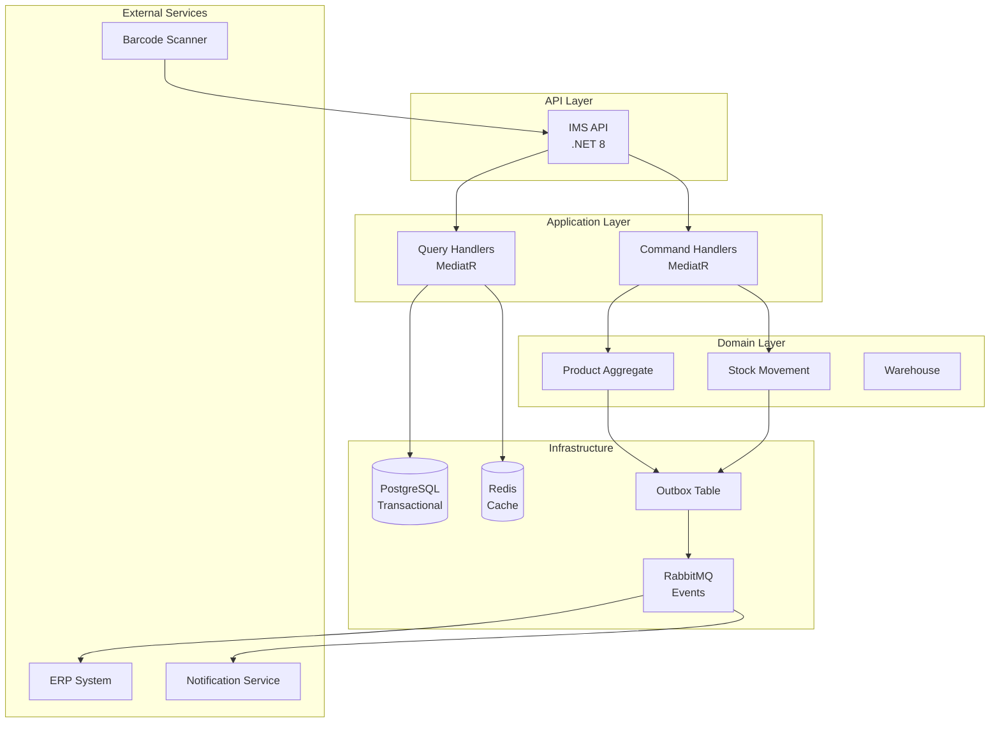

# IMS - Architecture & Design Document

## System Overview

**Name**: Inventory Management System (IMS)  
**Type**: Event-Driven Microservice  
**Domain**: E-Commerce / Retail  
**Primary Goal**: Real-time inventory tracking with event-driven architecture

---

## Architecture Diagram



---

## Event-Driven Architecture

### Outbox Pattern Flow

```
┌──────────────┐
│ HTTP Request │
└──────┬───────┘
       │
       ▼
┌──────────────────┐
│ Command Handler  │
└──────┬───────────┘
       │
       ▼
┌─────────────────────────────────────┐
│  Database Transaction               │
│  ┌──────────────┐  ┌─────────────┐ │
│  │ Update       │  │ Insert      │ │
│  │ Aggregate    │  │ Outbox Event│ │
│  └──────────────┘  └─────────────┘ │
└─────────────────────────────────────┘
       │
       ▼
┌──────────────────┐
│ Background Worker│ (Polls outbox every 5s)
└──────┬───────────┘
       │
       ▼
┌──────────────────┐
│ Publish to       │
│ RabbitMQ         │
└──────┬───────────┘
       │
       ▼
┌──────────────────┐
│ Event Consumers  │
└──────────────────┘
```

### Key Events

| Event | Trigger | Consumers |
|-------|---------|-----------|
| `ProductCreated` | New product added | ERP Sync, Search Index |
| `StockAdjusted` | Quantity changed | Reorder Service, Notifications |
| `LowStockDetected` | Quantity < threshold | Purchasing Team |
| `StockReserved` | Order placed | Order Service |
| `StockReplenished` | Stock received | Analytics |

---

## Domain Model

### Aggregates

#### Product Aggregate

```csharp
public class Product : AggregateRoot
{
    public Guid Id { get; private set; }
    public SKU SKU { get; private set; }  // Value Object
    public string Name { get; private set; }
    public decimal Price { get; private set; }
    public Quantity CurrentStock { get; private set; }  // Value Object
    public Quantity ReorderLevel { get; private set; }
    
    // Methods
    public void AdjustStock(int quantity, string reason);
    public bool IsLowStock();
    public void UpdatePrice(decimal newPrice);
    
    // Raises: StockAdjustedEvent, LowStockDetectedEvent
}
```

#### Stock Movement Aggregate

```csharp
public class StockMovement : AggregateRoot
{
    public Guid Id { get; private set; }
    public Guid ProductId { get; private set; }
    public Guid WarehouseId { get; private set; }
    public MovementType Type { get; private set; }  // IN, OUT, ADJUSTMENT
    public int Quantity { get; private set; }
    public string Reason { get; private set; }
    public DateTime OccurredAt { get; private set; }
    public Guid PerformedBy { get; private set; }
}
```

---

## Data Model

### Database Schema

```sql
-- Products Table
CREATE TABLE ims.products (
    id UUID PRIMARY KEY,
    sku VARCHAR(50) UNIQUE NOT NULL,
    name VARCHAR(200) NOT NULL,
    description TEXT,
    price DECIMAL(18,2) NOT NULL,
    current_stock INT NOT NULL DEFAULT 0,
    reorder_level INT NOT NULL DEFAULT 10,
    metadata JSONB,
    created_at TIMESTAMP NOT NULL,
    updated_at TIMESTAMP NOT NULL,
    version INT NOT NULL DEFAULT 1
);

CREATE INDEX idx_products_sku ON ims.products(sku);
CREATE INDEX idx_products_current_stock ON ims.products(current_stock);

-- Stock Movements Table
CREATE TABLE ims.stock_movements (
    id UUID PRIMARY KEY,
    product_id UUID NOT NULL REFERENCES ims.products(id),
    warehouse_id UUID NOT NULL,
    movement_type VARCHAR(20) NOT NULL,
    quantity INT NOT NULL,
    reason TEXT,
    occurred_at TIMESTAMP NOT NULL,
    performed_by UUID NOT NULL,
    metadata JSONB
);

CREATE INDEX idx_stock_movements_product ON ims.stock_movements(product_id, occurred_at DESC);
CREATE INDEX idx_stock_movements_warehouse ON ims.stock_movements(warehouse_id);

-- Outbox Events Table
CREATE TABLE ims.outbox_events (
    id UUID PRIMARY KEY,
    event_type VARCHAR(100) NOT NULL,
    aggregate_id UUID NOT NULL,
    payload JSONB NOT NULL,
    created_at TIMESTAMP NOT NULL,
    processed_at TIMESTAMP,
    retry_count INT DEFAULT 0
);

CREATE INDEX idx_outbox_unprocessed ON ims.outbox_events(created_at) 
WHERE processed_at IS NULL;
```

---

## API Design

### REST Endpoints

```
POST   /api/inventory/products              Create product
GET    /api/inventory/products/{id}         Get product by ID
GET    /api/inventory/products              List products (paginated)
PUT    /api/inventory/products/{id}         Update product
DELETE /api/inventory/products/{id}         Delete product (soft delete)

POST   /api/inventory/stock/adjust          Adjust stock quantity
GET    /api/inventory/stock/movements       Get stock movement history
GET    /api/inventory/stock/low             Get low-stock products

GET    /api/inventory/warehouses            List warehouses
POST   /api/inventory/warehouses            Create warehouse
```

### Request/Response Examples

**Create Product**:

```json
POST /api/inventory/products
{
  "sku": "LAPTOP-001",
  "name": "Dell Latitude 5420",
  "description": "14-inch business laptop",
  "price": 999.99,
  "initialStock": 50,
  "reorderLevel": 10,
  "warehouseId": "550e8400-e29b-41d4-a716-446655440000"
}

Response: 201 Created
{
  "id": "123e4567-e89b-12d3-a456-426614174000",
  "sku": "LAPTOP-001",
  "currentStock": 50,
  "createdAt": "2026-01-09T18:00:00Z"
}
```

**Adjust Stock**:

```json
POST /api/inventory/stock/adjust
{
  "productId": "123e4567-e89b-12d3-a456-426614174000",
  "quantity": -5,
  "reason": "Sold 5 units to customer #1234",
  "warehouseId": "550e8400-e29b-41d4-a716-446655440000"
}

Response: 200 OK
{
  "newStock": 45,
  "movementId": "789e4567-e89b-12d3-a456-426614174000",
  "isLowStock": false
}
```

---

## Technology Decisions

### Why .NET 8?

- Modern C# features (primary constructors, collection expressions)
- Excellent performance for API workloads
- Strong ecosystem for event-driven patterns
- Great tooling and debugging experience

### Why PostgreSQL?

- ACID compliance for inventory transactions
- JSONB support for flexible metadata
- Excellent performance for transactional workloads
- Robust indexing capabilities

### Why RabbitMQ?

- Reliable message delivery
- Flexible routing (topic exchanges)
- Dead letter queue support
- Good .NET client library

### Why Redis?

- Fast caching for frequently accessed products
- Reduce database load for read-heavy operations
- Pub/sub for real-time notifications

---

## Scalability Considerations

### Horizontal Scaling

- Stateless API design allows multiple instances
- Database connection pooling
- Redis for distributed caching
- RabbitMQ can scale with clustering

### Database Optimization

- Partition `stock_movements` table by date
- Archive old movements to separate table
- Use read replicas for query operations
- Implement database sharding by warehouse_id if needed

### Caching Strategy

```
Cache Duration:
- Product details: 10 minutes
- Stock levels: 1 minute (frequently changing)
- Warehouse list: 1 hour (rarely changes)

Cache Invalidation:
- On product update: Clear product cache
- On stock adjustment: Clear product cache
- Use Redis pub/sub for cache invalidation across instances
```

---

## Security Architecture

### Authentication Flow

```
Client → API Gateway → JWT Validation → IMS API
                          ↓
                    Azure AD B2C
```

### Authorization Levels

| Role | Permissions |
|------|-------------|
| Admin | Full access to all operations |
| InventoryManager | Create/update products, adjust stock |
| WarehouseStaff | View products, adjust stock (own warehouse) |
| ReadOnly | View products and stock levels |

### Data Security

- Encrypt connection strings (Azure Key Vault)
- Encrypt sensitive supplier data at rest
- TLS 1.3 for all API communication
- API rate limiting (100 req/min per client)
- SQL injection prevention (parameterized queries)

---

## Monitoring & Observability

### Metrics to Track

- Request latency (P50, P95, P99)
- Stock adjustment transaction rate
- Event publishing lag
- Outbox processing delay
- Cache hit/miss ratio
- Database connection pool usage

### Logging Strategy

```csharp
Log.Information("Stock adjusted: {@Event}", new
{
    ProductId = product.Id,
    SKU = product.SKU.Value,
    OldStock = oldQuantity,
    NewStock = newQuantity,
    Reason = reason,
    PerformedBy = userId
});
```

### Health Checks

```
/health/live    - Is service running?
/health/ready   - Can service handle requests?
  - Database connectivity
  - RabbitMQ connectivity
  - Redis connectivity
```

---

## Deployment Architecture

```
┌─────────────────────────────────────────┐
│ Azure Kubernetes Service (AKS)          │
│                                          │
│  ┌────────────┐  ┌────────────┐        │
│  │ IMS Pod 1  │  │ IMS Pod 2  │  ...   │
│  └────────────┘  └────────────┘        │
│                                          │
│  ┌────────────────────────────┐        │
│  │ Outbox Worker (Deployment) │        │
│  └────────────────────────────┘        │
└─────────────────────────────────────────┘
           ↓              ↓
   ┌──────────────┐  ┌──────────┐
   │ PostgreSQL   │  │ RabbitMQ │
   │ (Azure DB)   │  │ (AKS)    │
   └──────────────┘  └──────────┘
```

---

## Future Enhancements

1. **Predictive Analytics**: ML model for demand forecasting
2. **Multi-Warehouse Routing**: Optimize fulfillment from nearest warehouse
3. **Barcode Generation**: Auto-generate barcodes for new products
4. **Supplier Integration**: Auto-reorder from suppliers via API
5. **IoT Integration**: RFID tags for real-time tracking

---

**Document Version**: 1.0  
**Last Updated**: January 9, 2026  
**Author**: OpsVerse Team
