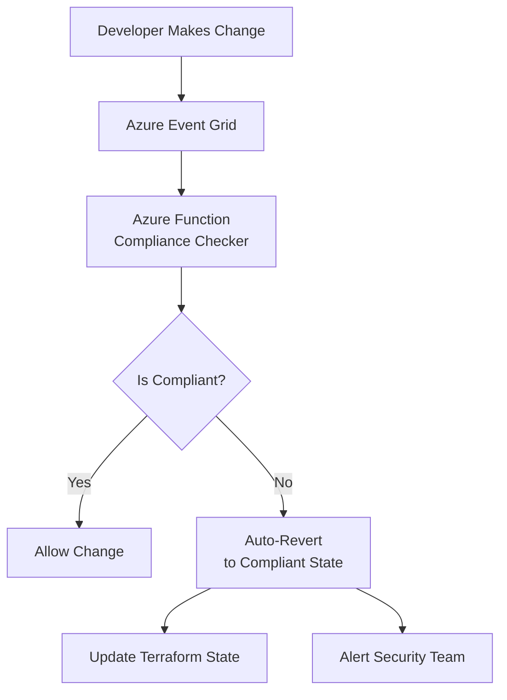

# GitHub Copilot Instructions - Infra-Guardian

## Project Overview  
**Module**: Infra-Guardian (Smart Infrastructure Incident & Compliance Platform)  
**Arabic Name**: منصة الحارس الذكي للبنية التحتية  
**Architecture**: Self-Healing Platform with Drift Detection  
**Tech Stack**: Python, Azure Policy, Azure Functions, Terraform, Event Grid  
**Domain**: Infrastructure / DevOps Automation

---

## Core Mission

This is **NOT** a simple ticketing system. Infra-Guardian is a **Self-Healing Platform** that doesn't just alert - it **fixes problems automatically**.

### Key Capabilities:
1. **Drift Detection**: Detects unauthorized infrastructure changes
2. **Auto-Remediation**: Fixes configuration drift automatically
3. **Compliance-as-Code**: Enforces policies (GDPR, ISO, SOC 2) automatically
4. **Real-time Compliance Dashboard**: Live compliance percentage tracking

---

## Technical Problems & Solutions

### 🔴 Problem 1: Configuration Drift
**Scenario**: A developer accidentally opens SSH port 22 to the internet on a production VM.

**The Fix - Self-Healing Implementation**:

```python
# Azure Function triggered by Event Grid
import azure.functions as func
from azure.mgmt.compute import ComputeManagementClient
from azure.identity import DefaultAzureCredential

def main(event: func.EventGridEvent):
    # Parse the event
    resource_data = event.get_json()
    
    if resource_data['operationName'] == 'Microsoft.Network/networkSecurityGroups/write':
        # Get NSG details
        nsg_id = resource_data['resourceId']
        
        # Check for open SSH port
        if has_open_ssh_port(nsg_id):
            # Auto-remediate: close the port
            close_ssh_port(nsg_id)
            
            # Log incident
            log_security_incident({
                'type': 'SSH_PORT_EXPOSED',
                'resource': nsg_id,
                'action': 'AUTO_REMEDIATED',
                'timestamp': datetime.utcnow()
            })
```

**Architecture Pattern**:
```
Infrastructure Change
    ↓
Azure Event Grid (listens to all resource changes)
    ↓
Azure Function (evaluates against policies)
    ↓
Auto-Remediation (reverts to compliant state)
    ↓
Terraform State Update (sync state file)
    ↓
Alert to Security Team (notification sent)
```

---

### 🔴 Problem 2: Manual Compliance Reporting
**Scenario**: Creating GDPR/ISO compliance reports takes weeks of manual work.

**The Fix - Real-time Compliance Dashboard**:

```python
# compliance_calculator.py
from azure.mgmt.security import SecurityCenter
from azure.mgmt.policyinsights import PolicyInsightsClient

class ComplianceCalculator:
    def calculate_gdpr_compliance(self):
        """Calculate real-time GDPR compliance percentage"""
        
        # Get all Azure Policy compliance states
        policy_states = self.policy_client.policy_states.list_query_results_for_subscription(
            subscription_id=self.subscription_id,
            query_options='$filter=policySetDefinitionName eq "GDPR"'
        )
        
        total_resources = 0
        compliant_resources = 0
        
        for state in policy_states:
            total_resources += 1
            if state.compliance_state == 'Compliant':
                compliant_resources += 1
        
        compliance_percentage = (compliant_resources / total_resources) * 100
        
        return {
            'percentage': compliance_percentage,
            'compliant': compliant_resources,
            'non_compliant': total_resources - compliant_resources,
            'timestamp': datetime.utcnow()
        }
```

**Dashboard Display** (using FastAPI + React):
```
╔══════════════════════════════════════╗
║  GDPR Compliance: 94.2% ✅           ║
║  ISO 27001:       87.5% ⚠️           ║
║  SOC 2:           100%  ✅           ║
╚══════════════════════════════════════╝

Non-Compliant Resources: 12
└─ 8 × Unencrypted Storage Accounts
└─ 3 × VMs without backup enabled
└─ 1 × Public SQL Database endpoint
```

---

### 🔴 Problem 3: Terraform State Drift
**Scenario**: Manual changes cause Terraform state to be out of sync.

**The Fix - Drift Detection & Alert**:

```hcl
# terraform/drift_detection.tf
resource "azurerm_resource_group_policy_assignment" "prevent_manual_changes" {
  name                 = "prevent-manual-changes"
  resource_group_id    = azurerm_resource_group.main.id
  policy_definition_id = data.azurerm_policy_definition.deny_manual_changes.id
  
  parameters = <<PARAMETERS
{
  "effect": {
    "value": "Deny"
  }
}
PARAMETERS
}

# Azure Policy: Deny manual VM creation
resource "azurerm_policy_definition" "deny_manual_vm" {
  name         = "deny-manual-vm-creation"
  policy_type  = "Custom"
  mode         = "All"
  display_name = "Deny manual VM creation"

  policy_rule = <<POLICY_RULE
{
  "if": {
    "allOf": [
      {
        "field": "type",
        "equals": "Microsoft.Compute/virtualMachines"
      },
      {
        "field": "tags['ManagedBy']",
        "notEquals": "Terraform"
      }
    ]
  },
  "then": {
    "effect": "deny"
  }
}
POLICY_RULE
}
```

---

## Architecture Design

### Self-Healing Flow



### Technology Stack Details

**Infrastructure as Code**:
- Terraform 1.6+ with Azure Provider
- Sentinel for policy enforcement
- Remote state in Azure Storage (encrypted)

**Automation Layer**:
```python
# Required Python packages
azure-mgmt-resource==23.0.0
azure-mgmt-policy==1.0.0
azure-functions==1.18.0
azure-eventhub==5.11.0
fastapi==0.109.0        # Dashboard API
redis==5.0.1            # Caching
```

**Monitoring & Alerting**:
- Azure Monitor for infrastructure telemetry
- Application Insights for function logs
- Azure Data Explorer for compliance analytics
- Logic Apps for alert routing

---

## Certification Alignment

### AZ-400 (DevOps Engineer Expert) - **PRIMARY**
**Skills Practiced**:
- CI/CD Pipelines for infrastructure (Plan → Apply → Validate)
- Azure Policy creation and enforcement
- Automated compliance testing
- Infrastructure monitoring and alerting

**Code Example for Certification**:
```yaml
# azure-pipelines.yml
trigger:
  - main

stages:
- stage: Validate
  jobs:
  - job: TerraformValidate
    steps:
    - task: TerraformInstaller@0
    - script: terraform init
    - script: terraform validate
    - script: terraform plan -out=tfplan
    - script: checkov -f tfplan  # Security scanning
    
- stage: ComplianceCheck
  jobs:
  - job: PolicyValidation
    steps:
    - script: |
        python scripts/check_compliance.py
        # Fail pipeline if compliance < 95%
```

### AZ-305 (Solutions Architect Expert)
**Skills Practiced**:
- High-availability infrastructure design
- Multi-region compliance enforcement
- Disaster recovery for critical systems
- Cost optimization with auto-scaling

### HashiCorp Terraform Associate
**Skills Practiced**:
- Advanced Terraform patterns (modules, remote state)
- Sentinel policy enforcement
- State management and locking
- Terraform Cloud integration

### GitHub Actions
**Skills Practiced**:
- Automated infrastructure deployment
- Secret management (Azure Key Vault integration)
- Matrix builds for multi-environment deployment

---

## Security Requirements

### 1. Identity & Access
```python
# Use Managed Identity (no credentials in code)
from azure.identity import DefaultAzureCredential

credential = DefaultAzureCredential()
policy_client = PolicyInsightsClient(credential, subscription_id)
```

### 2. Secrets Management
```bash
# All secrets in Azure Key Vault
az keyvault secret set \
  --vault-name infra-guardian-kv \
  --name "TerraformBackendKey" \
  --value "<storage-account-key>"
```

### 3. Audit Trail
Every auto-remediation is logged:
```python
{
  'timestamp': '2026-01-09T19:30:00Z',
  'resource_id': '/subscriptions/xxx/resourceGroups/prod/providers/Microsoft.Compute/virtualMachines/vm1',
  'drift_detected': 'SSH_PORT_EXPOSED',
  'action_taken': 'PORT_CLOSED',
  'performed_by': 'SYSTEM_AUTO_REMEDIATION',
  'approved_by': None  # Auto-approved for critical security issues
}
```

---

## Copilot Code Generation Guidelines

When I ask you to generate code for Infra-Guardian:

1. **Always use Azure Resource Manager SDK** (not Azure CLI in production code)
2. **Implement idempotent operations** - can run multiple times safely
3. **Add comprehensive logging** - every decision must be traceable
4. **Use async/await** for all Azure API calls (performance)
5. **Implement retry logic** with exponential backoff (Polly equivalent in Python)
6. **Add health checks** - ensure Event Grid connectivity
7. **Document every policy rule** with WHY it exists
8. **Test drift detection** - include unit tests for all scenarios
9. **Use type hints** in Python (for maintainability)
10. **Performance**: Cache policy evaluations (Redis) to avoid repeated Azure API calls

### Example Request Format
```
"Generate a Python Azure Function that:
- Listens to Event Grid events for storage account changes
- Checks if public access is enabled
- Auto-disables public access if detected
- Logs the incident to Application Insights
- Sends alert to security team via Logic Apps
- Includes unit tests"
```

---

## Performance & Scalability

### Expected Load
- **Events/day**: 10,000 - 100,000 (large Azure subscriptions)
- **Response time**: < 30 seconds for auto-remediation
- **Concurrent functions**: Up to 200 (Azure Functions auto-scale)

### Optimization Strategies
```python
# Cache policy definitions (they rarely change)
@lru_cache(maxsize=128)
def get_policy_definition(policy_id: str):
    return policy_client.policy_definitions.get(policy_id)

# Batch Event Grid events
def process_events_batch(events: List[EventGridEvent]):
    # Process 100 events at once
    with ThreadPoolExecutor(max_workers=10) as executor:
        futures = [executor.submit(process_event, e) for e in events]
        concurrent.futures.wait(futures)
```

---

## Real-World Impact

### Scenarios This Solves:
1. ✅ **Prevent Security Breaches**: Auto-close exposed ports, databases
2. ✅ **Maintain Compliance**: Always audit-ready (GDPR, ISO, SOC 2)
3. ✅ **Reduce Manual Work**: Compliance reports generated in real-time
4. ✅ **Cost Savings**: Auto-shutdown non-compliant expensive resources
5. ✅ **Faster Incident Response**: From hours to seconds

---

**When in doubt, prioritize**:
1. Security (auto-remediate critical issues immediately)
2. Compliance (enforce policies strictly)
3. Auditability (log everything)
4. Performance (use caching, async operations)
5. Testability (every function must have tests)
